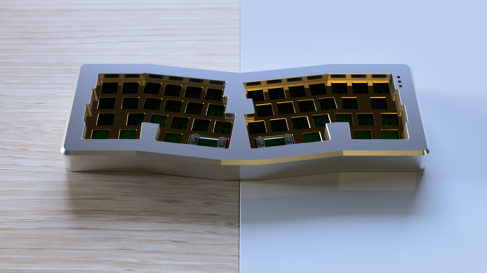
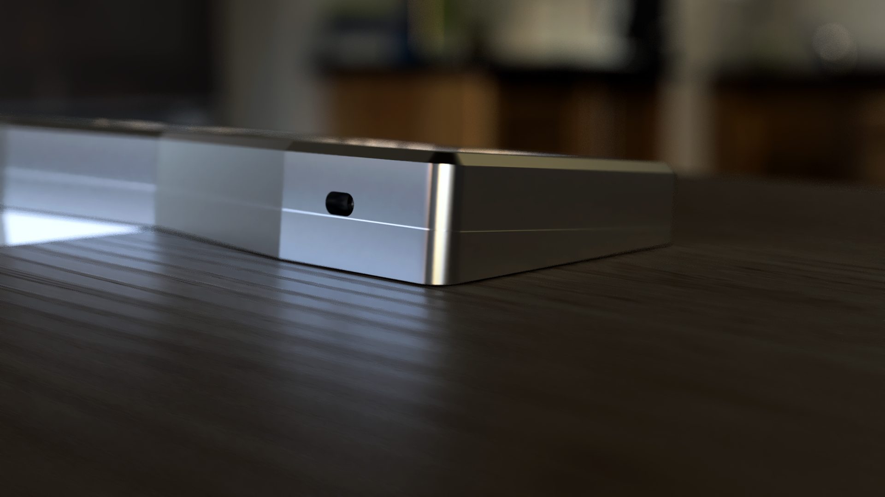
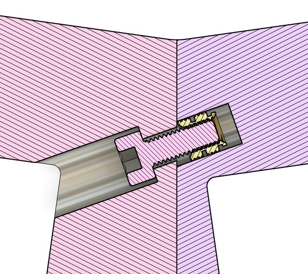
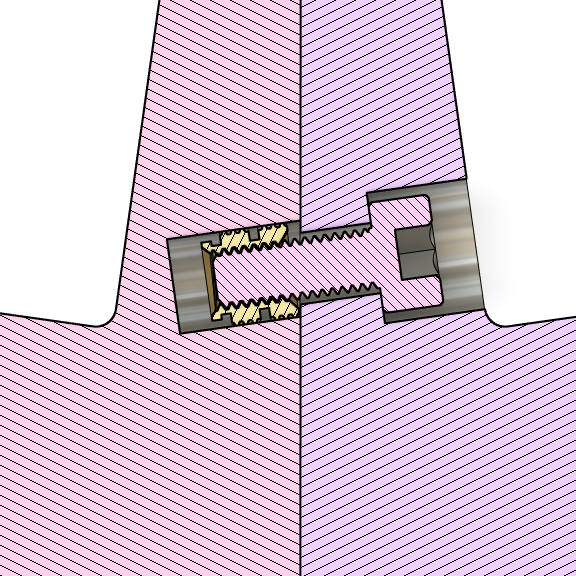

# Prime_E AngleMod Case

Angled case design for the Prime_E keyboard. Includes two sets of files:

+ Unbroken case for large format printers 
+ Logically split case for smaller print beds

**Please note: the design is compatible with the Rev2 Prime_E PCB, I haven't tested it with the Rev1**

## Changes from the original case

I remade the whole thing from scratch around the Rev2 PCB but the main differences are :
+ 5° angle
+ smaller usb cutout and centered on the usb port
+ switch cutouts are simple squares instead of the "dog bones"
+ more clearance for stabilizers
+ tweaked the exterior lines to be parallel with the switches
+ on the split version, two screws are used to hold the top halves together

## Assembly

| Item | Quantity | Notes |
| --- | --- | --- |
| [M3x8 Screws](https://www.aliexpress.com/item/32769412937.html) | 20 (+2 for the split version) | I used socket heads, but other types might work |
| [M3x5x4 brass inserts](https://www.aliexpress.com/item/4000232858343.html) | 20 (+2 for the split version) | I strongly suggest getting the same type as thoses I linked. I find them easier to install and stronger than the ones that looks like a simple cylinder with vertical stripes at the ends
| [30x5x1.5mm rubber feets](https://www.aliexpress.com/item/1005002019084238.html) | 4 | You can of course get some with different dimesions, but they won't look as nice, because I put small recesses on the bottom for this size |

When assembling the split version, be careful when installing the inserts holding the two halves together, they sit at an angle

  
*Top insert cross section*

  
*Bottom insert cross section*